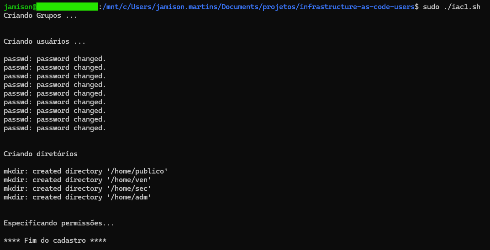
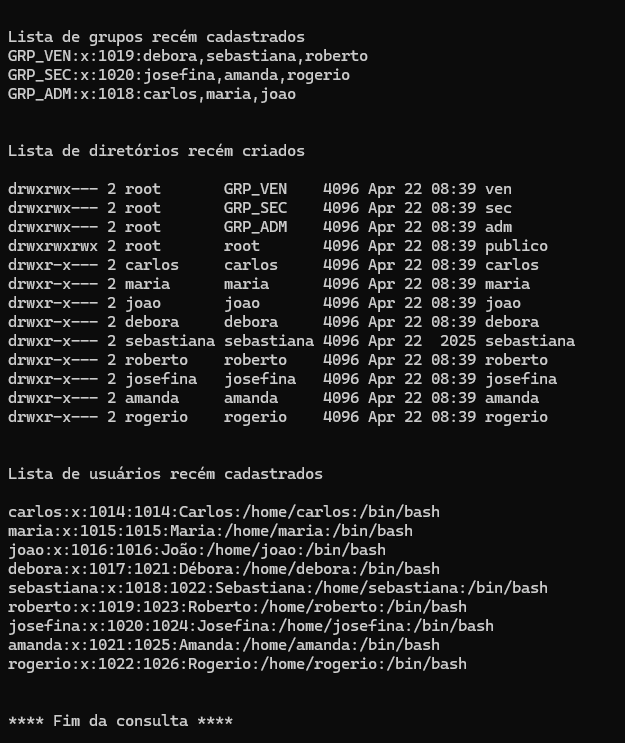

# 🚀 Desafio: Infrastructure as Code – Criação de Usuários no Linux

Este repositório contém um script Shell que automatiza a criação de diretórios, grupos e usuários, com configurações de permissões, seguindo o conceito de *Infrastructure as Code* (IaC).

Desenvolvido como parte de um desafio do bootcamp Linux, o objetivo é simular uma estrutura organizacional básica de uma empresa utilizando apenas comandos de terminal.

---

## 📂 Repositório

➡️ Repositório oficial: [jamisonmmartins/infrastructure-as-code-users](https://github.com/jamisonmmartins/infrastructure-as-code-users)

---

## ✅ Funcionalidades do Script

O script `iac1.sh` realiza:

- Criação dos diretórios dentro de `/home`:
  - `/home/publico`
  - `/home/adm`
  - `/home/ven`
  - `/home/sec`

- Criação dos grupos:
  - `GRP_ADM`
  - `GRP_VEN`
  - `GRP_SEC`

- Criação dos usuários:
  - Grupo ADM: `carlos`, `maria`, `joao`
  - Grupo VEN: `debora`, `sebastiana`, `roberto`
  - Grupo SEC: `josefina`, `amanda`, `rogerio`

- Atribuição de usuários aos seus respectivos grupos

- Permissões:
  - `/home/publico`: acesso total para todos os usuários
  - `/home/adm`, `/home/ven`, `/home/sec`: acesso exclusivo aos grupos correspondentes
  - Proprietário dos diretórios: `root`, com grupo responsável correspondente

- Feedback no terminal com `echo` a cada etapa

- Consulta final para verificar se tudo foi criado corretamente

---

## 💻 Como Utilizar

1. Faça um **fork** deste repositório para sua conta GitHub:
   > Clique no botão "Fork" no canto superior direito da página.

2. Clone o seu fork para sua máquina local:
   ```bash
   git clone https://github.com/seu-usuario/infrastructure-as-code-users.git
   cd infrastructure-as-code-users
   ```

3. Torne o script executável:
    ```bash
    chmod +x iac1.sh
    ```

4. Execute com permissões de superusuário:
    ```bash
    sudo ./iac1.sh  
    ```

## 📸 Exemplos Visuais
Abaixo estão prints da execução do script iac1.sh, mostrando a criação e configuração dos recursos:

▶️ Criando grupos, usuários, diretórios e configurando permissões


✅ Listando usuários, diretórios e grupos recém criados


## 🧾 Requisitos
- Distribuição Linux
- Acesso root ou permissão para usar sudo
- Terminal Bash
- Sistema operacional base: Windows 11 com WSL 2 (Windows Subsystem for Linux)

## 💻 Ambiente de Desenvolvimento Utilizado
Este script foi desenvolvido e testado em:

- 💻 Sistema Operacional: Windows 11
- 🐧 Distribuição Linux: Ubuntu 24.04 LTS
- 🔧 Ambiente: WSL 2 (Windows Subsystem for Linux)

## ℹ️ Observações
Este script foi criado para fins educacionais e pode ser adaptado para outros cenários.
Não é recomendado executá-lo em ambientes de produção sem as devidas adaptações.

## 

Feito com 💻 e ☕ por Jamison Martins